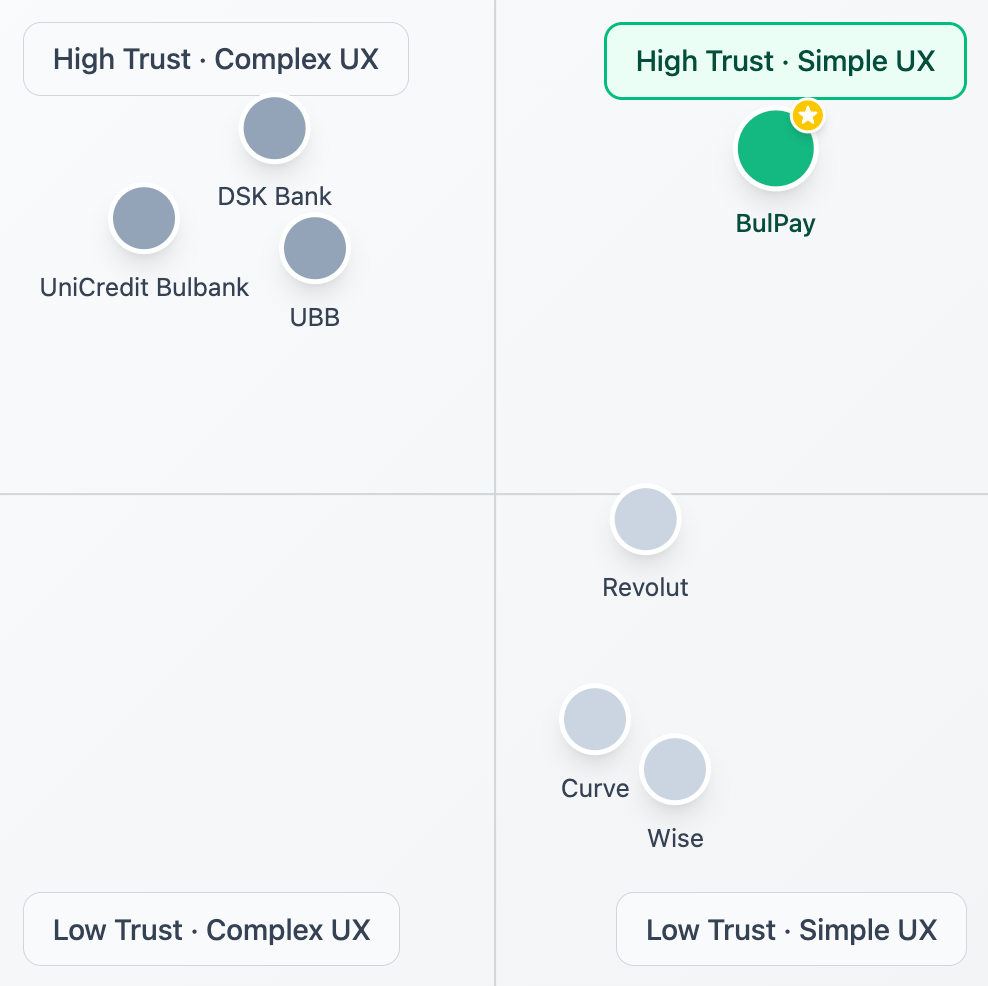

# 💳 BULPAY — Market Research Report

### *A Digital Wallet for Tech-Shy Adults in Bulgaria*

---

> **Disclaimer:** This is a demo market research paper.

| Field           | Details         |
| --------------- | --------------- |
| **Prepared by** | Boris Tsvetanov |
| **Date**        | April 2026      |
| **Status**      | 🔄 In Progress  |

---

## Table of Contents

1. [Executive Summary](#1-executive-summary)
2. [The Bulgarian Digital Payments Market — Macro Overview](#2-the-bulgarian-digital-payments-market--macro-overview)
3. [Target Audience Deep-Dive — The Older Bulgarian User (45+)](#3-target-audience-deep-dive--the-older-bulgarian-user-45)
4. [Problem Validation — Why Current Solutions Are Failing This Segment](#4-problem-validation--why-current-solutions-are-failing-this-segment)
5. [Competitive Landscape](#5-competitive-landscape)
6. [Regulatory & Compliance Landscape — Bulgaria Specific](#6-regulatory--compliance-landscape--bulgaria-specific)
7. [BulPay Product Definition — Feature Prioritisation Based on Research](#7-bulpay-product-definition--feature-prioritisation-based-on-research)
8. [Go-to-Market Strategy](#8-go-to-market-strategy)
9. [Risk Assessment](#9-risk-assessment)
10. [Key Findings & Strategic Recommendation](#10-key-findings--strategic-recommendation)

---

## 1. Executive Summary

Bulgaria has a notable digital payments gap. Traditional bank apps from UniCredit Bulbank, UBB, and DSK charge high fees, deliver poor user experiences, and suffer from regular crashes that erode user confidence. Foreign neobanks such as Revolut offer lower fees but are perceived as complex, untrustworthy, and inaccessible by a significant portion of the Bulgarian population — particularly adults aged 45 and above.

BulPay is a mobile-first digital wallet designed to close this gap. Its core proposition is simple: stress-free, low-fee peer-to-peer (P2P) money transfers with card aggregation functionality, delivered in Bulgarian, backed by local customer support, and purpose-built for the 45–65 year old demographic, which amounts to 30% of the total Bulgarian population — and yet no current player has meaningfully served them.

Primary research conducted with 10 participants from the target segment confirmed that fees and psychological anxiety — not speed — are the dominant pain points during digital payments. This insight has shaped BulPay's core promise: not just a faster wallet, but a calmer, more confident payment experience.

### 🔍 Key Findings at a Glance

- The Bulgarian 45+ adult segment is digitally capable but underserved — a white space no incumbent has targeted.
- Both traditional banks and neobanks fail this segment, though for different and complementary reasons.
- Core user motivations are: **avoiding fees**, **avoiding errors**, and **feeling safe** — in that order.
- BulPay's positioning on the intersection of low fees + local trust + simplified UX is currently unoccupied.
- Go-to-market must rely on trust-based and community channels, not digital advertising.

---

## 2. The Bulgarian Digital Payments Market — Macro Overview

### 2.1 Market Size & Growth

Bulgaria sits at a fascinating crossroads: a European Union member state with high smartphone penetration but one of the lowest digital payment adoption rates in the EU. This lag is not a sign of a failed market — it is a sign of an untapped one.

- **TBD** — Digital payments market in Bulgaria (transaction volume, CAGR projections). *Source: BNB Annual Payments Report / Eurostat.*
- Bulgaria consistently ranks among the bottom three EU member states in cashless payment adoption.
- Cash remains the dominant payment method, particularly for utility bills and everyday transfers between individuals.
- The National Bank of Bulgaria (BNB) has noted a gradual but steady increase in card-based and mobile payment usage post-2020, accelerated by COVID-19 contactless payment adoption.

---

### 2.2 Cash vs. Digital Payment Adoption

A defining characteristic of BulPay's opportunity is the extent to which cash persists as the default for this segment. This is not merely a preference — it is a rational behaviour driven by the failure of digital alternatives.

- Utility bill payments via EasyPay remain predominantly cash-based among the 45+ demographic, largely because online payment fees discourage digital alternatives.
- Users have normalised friction in digital banking. They do not actively search for alternatives because they do not believe better alternatives exist.
- This normalisation is a key strategic insight: BulPay cannot rely on pull marketing — the audience must be reached through trusted intermediaries and contextual touchpoints.

---

### 2.3 Smartphone Penetration Among 45+ Bulgarians

- Smartphone penetration among Bulgarians aged 45–65: approximately **67%**
- Android dominates device preference in this demographic, consistent with lower average income levels and established Android ecosystems.
- App download behaviour is present — the target segment is comfortable downloading applications when nudged by a trusted source (e.g. a family member).
- The barrier is not installation. It is trust, onboarding clarity, and sustained confidence in using the product.

---

### 2.4 Internet Banking Adoption by Age Group

- Internet banking adoption rate among Bulgarians aged 45–65: approximately **15%**
- Usage of mobile banking apps in the 45+ segment is present but characterised by high anxiety and low frequency beyond balance checks.
- Many users in this segment rely on their children or younger relatives to set up and explain digital financial services — a strong signal for BulPay's family referral channel strategy.

---

### 2.5 Bulgaria-Specific Economic Context

- Bulgaria has the lowest average income in the EU, making high bank fees proportionally more painful for lower-income users.
- Median monthly salary: **€1,020**. Minimum wage: **€620**.
- For George — a cashier on a low income sending money weekly to family members — a fee of even 50 cents per transaction accumulates meaningfully over a month.
- Cultural trust in financial institutions is historically tied to local, physical presence. Foreign-registered fintech companies face an inherent trust deficit with this demographic.

---

## 3. Target Audience Deep-Dive — The Older Bulgarian User (45+)

This is the most critical section of the BulPay research. The entire product thesis rests on the claim that this segment is real, underserved, and reachable. The following is built on primary research: 10 qualitative user interviews conducted using the Mom Test framework, and the resulting user persona.

### 3.1 Demographic Overview

- Target age range: **45–65 years old.**
- Population of Bulgarians aged 45–65: **~1.94 million** people, representing **~30% of all Bulgarians.**
- Primary urban clusters: Sofia, Plovdiv, Varna — cities with sufficient digital infrastructure and higher population density to support early-stage growth.
- Income level: low-to-middle. Many in skilled manual or service-sector employment (cashiers, healthcare workers, tradespeople, public sector employees).
- Family structure: typically parents with adult or near-adult children, frequently transferring money for household expenses, tuition, and shared bills.

---

### 3.2 User Persona — George

> *The following persona was derived from interview synthesis across 10 participants and represents the archetypal BulPay user.*

| Field                | Details                                                                                                     |
| -------------------- | ----------------------------------------------------------------------------------------------------------- |
| **Name**             | George                                                                                                      |
| **Age**              | 53                                                                                                          |
| **Occupation**       | Cashier                                                                                                     |
| **Location**         | Sofia, Bulgaria                                                                                             |
| **Income**           | Low                                                                                                         |
| **Device**           | Android smartphone                                                                                          |
| **Digital Profile**  | Not tech-savvy, but capable — uses both Revolut and a local bank app                                        |
| **Primary goal**     | Send money quickly and cheaply to family without stress or confusion                                        |
| **Core pain points** | High bank fees · App crashes · Password overload · Distrust of foreign banks                                |
| **Behaviour**        | Sends money weekly; pays utility bills in cash to avoid fees; checks balance every other day out of anxiety |

---

### 3.3 Psychographic Profiling

What emerged most powerfully from the 10 interviews was not a list of features users wanted — it was a set of values and emotional states that govern their relationship with digital money.

#### Core Values

- **Security first.** Every financial action is treated as potentially irreversible and high-stakes. Users double-check, re-read, and hesitate — not out of confusion, but out of rational caution.
- **Local identity and trust.** The knowledge that a service is Bulgarian-owned and operated, and that a Bulgarian-speaking human is reachable if something goes wrong, is a material decision factor — not a nice-to-have.
- **Simplicity over features.** This segment does not want a super-app. They want one thing done reliably: send money, know it arrived, move on.
- **Predictability.** They want to know what will happen before they confirm. Surprises — even positive ones — are unwelcome in a financial context.

#### Emotional Profile During Payments

- Stress and anxiety are the dominant emotions during digital transfers — particularly on bank apps that crash or provide unclear confirmations.
- Users have normalised this anxiety. They describe it as *"just how it is"* — which means reducing it will feel genuinely transformative, not merely convenient.
- Speed was initially assumed to be a priority. User interviews disproved this. **Calmness and correctness matter more than speed.**

---

### 3.4 Tech Anxiety Mapping

Understanding where exactly the 45+ user experiences friction is essential for prioritising BulPay's UX decisions.

- **KYC onboarding** processes are a major drop-off point — unfamiliar language, document upload steps, and multi-screen flows create confusion.
- **Password and PIN management** across multiple apps is a persistent source of frustration. Users want fewer credentials, not more.
- **Confirmation ambiguity:** when an app does not clearly signal *"your money has been sent"*, users are left in a state of anxious uncertainty and often check their balance immediately after.
- **App crashes** during payment flows are experienced as deeply distressing — not merely inconvenient — because users cannot tell whether the payment went through.

---

### 3.5 Financial Literacy & Banking Habits

- Most 45+ Bulgarian users are unaware that their salaries can be received via digital wallets like Revolut — they perceive these as supplementary tools, not primary banking infrastructure.
- Investment and savings behaviour remains firmly within traditional bank accounts. BulPay does not need to compete here at MVP stage.
- Utility bill payments are frequently made in cash at EasyPay physical terminals — specifically to avoid online fees. This is an opportunity: if BulPay can eliminate or significantly reduce bill payment fees, it becomes immediately valuable.

---

### 3.6 Preferred Communication & Support Channels

- **Phone calls** to a Bulgarian-speaking support agent are the gold standard for issue resolution. Live chat is acceptable. Email and chatbot are not.
- **In-person or video-call onboarding assistance** would be a significant trust-builder for first-time users.
- **Trusted peer referral** (especially from adult children) is the highest-converting discovery channel for this segment.

---

## 4. Problem Validation — Why Current Solutions Are Failing This Segment

The BulPay opportunity is not speculative. It is the direct consequence of two parallel market failures — one from the incumbent banks, one from the challenger neobanks — that happen to leave the same demographic entirely unserved.

### 4.1 The Dual Failure Framework

Traditional Bulgarian banks and neobanks like Revolut fail the 45+ segment for entirely different reasons — which is precisely what creates the gap BulPay can fill.

|                       | **UniCredit Bulbank** | **UBB**   | **DSK Bank** | **Revolut**      | **BulPay (Target)**    |
| --------------------- | --------------------- | --------- | ------------ | ---------------- | ---------------------- |
| **Fees**              | High                  | High      | High         | Low              | **Low**                |
| **App Stability**     | Poor                  | Poor      | Poor         | Good             | **Good**               |
| **UI/UX Quality**     | Cluttered             | Cluttered | Cluttered    | Modern / complex | **Simple & clear**     |
| **Designed for 45+**  | ✗                     | ✗         | ✗            | ✗                | **✓**                  |
| **Local Trust**       | High                  | High      | High         | Low              | **High**               |
| **Bulgarian Support** | Limited               | Limited   | Limited      | None             | **Full**               |
| **Crash-prone**       | Yes                   | Yes       | Yes          | Rarely           | **No**                 |
| **Card Aggregation**  | No                    | No        | No           | Partial          | **Yes (core feature)** |

---

### 4.2 How Traditional Banks Are Failing

#### High Fees

For a low-income user like George, bank transfer fees are not a minor inconvenience — they are a monthly drain. Sending money weekly to multiple family members at local bank rates creates a material and avoidable cost. This directly drives cash-based workarounds (e.g. physical EasyPay visits, paying rent with cash, etc.) that consume time and effort.

#### Poor UI/UX & App Instability

Local bank apps were not designed with the 45+ user in mind. Small fonts, dense navigation, banking jargon, and multi-step flows create cognitive overload. More critically, these apps crash and freeze during online payments — at the exact moment of highest user vulnerability. A payment that fails mid-submission leaves users in acute anxiety: *did it go through? Is my money gone?* This is not a UX inconvenience. It is a trust-breaking event.

#### No Design Empathy for This Segment

None of the major Bulgarian bank apps have been meaningfully updated with accessibility or demographic-specific design in mind. The older user is an afterthought, if considered at all.

---

### 4.3 How Neobanks Are Failing

#### Complexity & Foreign Identity

Revolut, despite its low fees, is experienced as a foreign product by older Bulgarians. The onboarding process — KYC with document scanning, multiple verification steps, English-first interfaces — creates immediate friction for users who are not digitally confident. The product was designed for urban millennials in Western Europe. It shows.

#### Absence of Local Trust

Trust, in this context, is not abstract. It is the concrete certainty that if something goes wrong with your money, a person who speaks your language and understands your context can help you. Revolut's support structure — international chat, limited Bulgarian content — fails this test entirely. The research revealed that older Bulgarians are sceptical of "internet-only" banks with no Bulgarian physical presence and no local legal entity they can identify with.

#### Feature Overload

Revolut's breadth of features — crypto, savings vaults, travel insurance, stock trading — is a distraction for a user who simply wants to send money to their child. The product's complexity signals *"this is not for me."*

---

### 4.4 The Validated Pain Point Hierarchy

Based on 10 qualitative user interviews using the Mom Test framework, the following pain point hierarchy was established:

| Rank | Pain Point                                               | Interview Frequency |
| ---- | -------------------------------------------------------- | ------------------- |
| 1st  | High fees on bank transfers                              | 10/10 participants  |
| 2nd  | Anxiety and psychological stress during digital payments | 10/10 participants  |
| 3rd  | App crashes and instability                              | 8/10 participants   |
| 4th  | Distrust of foreign or unfamiliar financial services     | 7/10 participants   |
| 5th  | Password/PIN overload across multiple apps               | 6/10 participants   |

> *Note: Speed of payment was initially hypothesised as a top-3 priority. Interviews revealed it ranks lower than fees and anxiety. This finding directly shaped BulPay's core promise: 'simple, **stress-free** payments' rather than 'simple, **fast** payments'.*

---

## 5. Competitive Landscape

BulPay operates in a market with well-established incumbents but no direct competitor targeting the 45+ Bulgarian demographic with a simplified, locally-trusted digital wallet. The competitive threat is real but the white space is clear.

### 5.1 Tier 1 — Traditional Bulgarian Banks

#### UniCredit Bulbank

- Largest retail bank in Bulgaria by asset size and customer base.
- Mobile app: available on Android and iOS. Reviews indicate poor UI, frequent crashes, and confusing payment flows.
- Transfer fees: among the highest in the market.
- Local trust: very high — physical branch network across Bulgaria provides reassurance.
- **Threat to BulPay:** low on UX/fee dimensions; high on trust and brand recognition.

#### United Bulgarian Bank (UBB)

- Second-tier retail bank with a broad customer base.
- Mobile app experience: similar criticisms to UniCredit — cluttered interface, stability issues, high fees.
- Notable: UBB has a partnership with postbank branches which expands physical reach. This matters for the older demographic.

#### DSK Bank

- State-linked heritage gives DSK particular credibility with older Bulgarians who associate it with a long-standing, stable institution.
- Digital transformation has been slower than competitors.
- High local trust, poor digital experience — same structural problem as peers.

---

### 5.2 Tier 2 — Foreign Neobanks & EMIs

#### Revolut

- Dominant neobank in Bulgaria with strong adoption among the 18–40 urban demographic.
- Low fees, wide feature set, good app stability.
- **Key weakness for BulPay's target segment:** no Bulgarian-language primary support, no physical presence, complex onboarding, and a feature set that overwhelms non-tech-savvy users.
- Research finding: Several interview participants use Revolut for small payments but remain on their local bank for anything they consider *'serious'* — a clear signal of limited trust penetration in this segment.

#### Wise (TransferWise)

- Primarily used for international transfers. Less relevant as a direct P2P domestic competitor.
- Low brand recognition among the 45+ Bulgarian demographic.
- Not a primary competitive threat at MVP stage.

#### Curve

- Very similar in features to BulPay.
- Extremely low presence in the Bulgarian market, and even lower among 45+ year olds.
- Not a primary competitive threat at MVP stage.

---

### 5.3 Tier 3 — Emerging Local Players

- **TBD** — further competitive analysis on local Bulgarian fintech players, fee structures, and UX quality required before board presentation.

---

### 5.4 Positioning Map — The BulPay White Space

When mapping the competitive landscape on two axes — ease of use for 45+ and local trust — the unoccupied white space becomes clear:

BulPay Positioning Map

> *BulPay's target position — High Local Trust + Simple UX — is currently unoccupied by any player in the market.*

---

## 6. Regulatory & Compliance Landscape — Bulgaria Specific

Regulatory readiness is not a backlog item for BulPay — it is a prerequisite for launch and a core component of the trust story. Bulgaria's regulatory environment is shaped by EU-level directives and implemented through Bulgarian national law. This section outlines the key obligations BulPay must satisfy before it can legally offer payment services.

### 6.1 Payment Institution License — Bulgarian National Bank (BNB)

BulPay must obtain a Payment Institution (PI) license from the Bulgarian National Bank under the Bulgarian Payment Services and Payment Systems Act (ZPUPPS), which transposes the EU's Payment Services Directive 2 (PSD2) into Bulgarian law.

#### Key Licensing Requirements

- **Minimum initial capital:** €50,000 for payment institutions offering P2P transfer and card-linked services *(exact threshold depends on service scope; confirm with BNB pre-submission)*.
- **Fit and proper test** for directors and key function holders: BNB will assess the integrity, competence, and financial soundness of management.
- **Operational resilience plan:** BulPay must demonstrate robust IT systems, business continuity plans, and fraud detection capabilities.
- **Safeguarding of client funds:** user funds must be held in a segregated account at a regulated credit institution or covered by an appropriate insurance policy.
- **Submission documentation** includes: a business plan (3-year financial projections), AML/CFT policy, security policy, and outsourcing arrangements.

#### Timeline Estimate

| Stage                      | Duration                                         |
| -------------------------- | ------------------------------------------------ |
| Pre-submission preparation | 2–4 months *(engage specialist counsel early)*   |
| BNB review period          | 3 months statutory; 4–6 months practical         |
| **Total to license**       | **Target: 6–8 months from start of preparation** |

---

### 6.2 PSD2 — EU Payment Services Directive (Second)

As a Bulgarian PI operating under PSD2, BulPay must comply with the following obligations:

- **Strong Customer Authentication (SCA):** all payment transactions above €30 must be authenticated using at least two independent factors (e.g. PIN + device possession). BulPay's Phase 2 biometric login (Face ID / Touch ID) directly satisfies this requirement.
- **Secure communication:** all data exchange between BulPay and card networks or banks must use TLS 1.2+ encryption.
- **Transparency on fees:** PSD2 Article 45 requires that payment service providers give users clear, prior information on all applicable fees before execution. BulPay's transparent fee display feature is a direct compliance mechanism.
- **Liability for unauthorised transactions:** if a user reports an unauthorised payment within 13 months, BulPay must refund the full amount unless gross negligence is proven.

---

### 6.3 KYC / AML Obligations

Under the Bulgarian Measures Against Money Laundering Act (ZMIP, transposing AMLD5/AMLD6), BulPay must implement a full AML/CFT framework.

- **Customer Due Diligence (CDD):** verify the identity of all users at onboarding using government-issued ID. For the 45+ demographic, this flow must be designed with extreme simplicity — a direct product-compliance intersection.
- **Enhanced Due Diligence (EDD):** required for higher-risk customers or transactions above defined thresholds.
- **Transaction monitoring:** automated flagging of unusual activity patterns. BulPay must define and document its monitoring rules.
- **Suspicious Activity Reporting:** BulPay must appoint a Money Laundering Reporting Officer (MLRO) and file Suspicious Transaction Reports (STRs) with the State Agency for National Security (DANS).
- **Record-keeping:** customer identity and transaction records must be retained for a minimum of 5 years post-relationship.

---

### 6.4 GDPR — Data Protection

- BulPay processes special-category financial data of EU residents. Full GDPR compliance is mandatory and non-negotiable.
- A **Data Protection Impact Assessment (DPIA)** must be conducted before launch, given the sensitivity of financial transaction data.
- Users must be given clear, plain-language consent and privacy notices — particularly important for a 45+ audience with lower digital literacy.
- **Data minimisation:** only collect data strictly necessary for the service.
- **Right to erasure and portability:** standard GDPR obligations apply; BulPay must build these into its data architecture from day one.

---

### 6.5 Consumer Protection for Elderly Users

Bulgaria's Consumer Protection Act and the EU's Consumer Rights Directive create specific obligations relevant to BulPay's target demographic:

- Pre-contractual information must be provided in **clear, plain language** (no jargon) — directly aligned with BulPay's design principles.
- **14-day cooling-off period** for distance financial services contracts.
- **Complaints handling:** BulPay must have a documented, accessible complaints procedure. For the 45+ segment, a phone-based channel is both a regulatory best practice and a product necessity.

---

### 6.6 Regulatory Risk & Timeline Summary

- Licensing is the **critical-path dependency:** no licensed PI = no legal product. Begin preparation immediately upon securing seed funding.
- Appoint a Bulgarian payments compliance specialist as an early hire or retained advisor — not an afterthought.
- BulPay's consumer-friendly, transparent, locally-supported product design is itself a **compliance asset**: it aligns with the spirit of PSD2 and consumer protection law.

---

## 7. BulPay Product Definition — Feature Prioritisation Based on Research

Every feature decision in BulPay is anchored to a validated user pain point or a confirmed value from primary research. This section defines the MVP scope and the UX principles that govern it.

### 7.1 BulPay Core Value Proposition

> ***"BulPay helps Bulgarians send money to family with confidence, not stress. No jargon. No guessing. Simple, stress-free transfers in Bulgarian — backed by local support you can rely on."***

---

### 7.2 MVP Feature Set

#### ✅ Core MVP Features (Phase 1)

| Feature                             | Rationale                                                                                      |
| ----------------------------------- | ---------------------------------------------------------------------------------------------- |
| **P2P Money Transfer**              | Primary and only transaction type at MVP. Full confirmation at every step.                     |
| **Card Aggregation (Card Swap)**    | Link multiple bank cards; choose which to pay from. Eliminates multi-app switching.            |
| **Simplified Login**                | Simple PIN code entry — low friction, familiar to target demographic.                          |
| **Saved Recipients**                | Store family contacts for one-tap repeat transfers.                                            |
| **Transaction Confirmation Screen** | Explicit success screen with reference number, recipient name, amount, and green visual cue.   |
| **Balance Visibility**              | Single-screen balance across all linked cards.                                                 |
| **Transaction History**             | Latest 3 transactions on home screen with "see all" expansion.                                 |
| **Freeze Card**                     | Improves psychological safety — users can immediately freeze their card if they suspect fraud. |

#### 🛡️ Trust-Building Features

- **Bulgarian-language interface throughout** — no English fallbacks, no untranslated banking jargon.
- **Transparent fee display** — show exactly what the user will be charged before they confirm, with a comparison to typical bank fees as reassurance.
- **Freeze Card** — allows users to freeze their card at any time, signalling psychological safety if they make a mistake or suspect fraud.
- **'Help' button** always visible on every screen.

#### 🔮 Phase 2 Features (Post-MVP)

- Local customer support access — phone number and working hours displayed on the home screen.
- Minimal-step KYC — Bulgarian-language throughout, clear progress indicators, visual walkthrough.
- **Biometric login** (Face ID / Touch ID) — eliminates password overload; also satisfies PSD2 SCA requirements.
- **Scheduled / recurring transfers** — for users who send the same amount to the same recipient each month.
- **Utility bill payments** (water, gas, electricity) — directly targeting the EasyPay cash behaviour identified in research.
- Top-Up functionality.
- **Delivery notification** — a push notification confirming the recipient received the funds.

---

### 7.3 UX Principles for the 45+ User

The following principles are non-negotiable design constraints derived directly from user research. They govern every screen in the BulPay prototype.

| Principle                         | Implementation                                                                       |
| --------------------------------- | ------------------------------------------------------------------------------------ |
| **Large, legible typography**     | Minimum 16pt body text. No small print. No icon-only navigation.                     |
| **No jargon**                     | 'Send money' not 'initiate a transfer'. 'Who are you sending to?' not 'beneficiary'. |
| **Explicit confirmation**         | Users should never wonder if their action registered.                                |
| **Undo safety net**               | Offer a 'cancel' window before processing — reduces fear of irreversible mistakes.   |
| **One primary action per screen** | Never ask users to process multiple decisions simultaneously.                        |
| **Trustworthy colour language**   | Blue, white, and green (success). No neon, no flashy gradients.                      |

---

### 7.4 MVP Experiment Canvas — Key Validated Assumptions

| Status          | Assumption                                                                                       |
| --------------- | ------------------------------------------------------------------------------------------------ |
| ✅ **VALIDATED** | Users experience genuine stress and hesitation during money transfers, even if normalised.       |
| ✅ **VALIDATED** | Confidence and predictability are prioritised over additional features.                          |
| ✅ **VALIDATED** | Reduced uncertainty is perceived as meaningful product value, not cosmetic UX.                   |
| ✅ **VALIDATED** | Switching cost is low — users do not need to migrate balances or replace their primary bank.     |
| 🔄 **ADJUSTED** | Speed is not a top-3 priority. Fees and anxiety rank above it. Core promise updated accordingly. |
| ⏳ **PENDING**   | Whether ≥80% of users can complete the transfer flow without moderator assistance.               |

---

### 7.5 Usability Test Hypotheses

Four hypotheses are currently being tested through moderated usability sessions with 6 participants:

| Hypothesis                    | Success Criteria                                                                                      |
| ----------------------------- | ----------------------------------------------------------------------------------------------------- |
| **H1 — Core Flow Simplicity** | ≥5/6 participants complete 'Send €15 to a saved recipient' without assistance in ≤3 minutes.          |
| **H2 — Home Screen Clarity**  | ≥5/6 participants tap the correct entry point within 15 seconds without exploring unrelated features. |
| **H3 — Trustworthiness**      | ≥5/6 participants rate confidence that money was sent at ≥5/7 and can identify two confirmation cues. |
| **H4 — Security**             | ≥5/6 participants rate their feeling of safety at ≥5/7 and fewer than 2 question the PIN step.        |

> *Results: Usability testing is currently in progress. Results to be incorporated upon completion.*

---

## 8. Go-to-Market Strategy

BulPay's go-to-market strategy must be fundamentally different from a standard fintech launch. The 45+ Bulgarian tech-shy user does not scroll LinkedIn, does not respond to digital ads, and does not browse the App Store looking for payment alternatives. They must be reached where they already are — physically, socially, and emotionally.

### 8.1 Core GTM Principle — Trust Before Acquisition

> In this segment, **trust is the product.** Before any user will download and use BulPay, they need to have heard about it from someone they trust, in a context that feels safe. This drives every channel and messaging decision below.

---

### 8.2 Channel Strategy

#### 📱 Channel 1 — Family Referral *(Primary)*

The most powerful discovery channel for BulPay is a younger family member who installs and explains the product to an older relative. This mirrors how Revolut spread, but via word-of-mouth in families rather than social media.

- **Tactical activation:** a 'Set up BulPay for someone you love' referral flow — onboard a family member remotely or in-person.
- **Incentive structure:** referral rewards analogous to the Revolut tactic. *(Details TBD)*
- The MVP Experiment Canvas explicitly identified family referrals as the primary trust-based channel.

#### 🏪 Channel 2 — Physical Community Touchpoints

Older Bulgarians frequent specific physical locations regularly — pharmacies, post offices, GP waiting rooms, local supermarkets, and community centres. These are moments of low urgency and high receptivity.

- Partnership with pharmacy chains and post office networks for in-store leaflet placement and staff word-of-mouth.
- Municipality partnerships for community event presence — particularly in Sofia, Plovdiv, and Varna.
- Branded leaflets in Bulgarian with a QR code linking to an assisted onboarding video.

#### 📺 Channel 3 — Trusted Bulgarian Media

This demographic watches Bulgarian national television and listens to local radio. These channels carry a legitimacy that social media does not.

- Targeted advertorial content in well-regarded Bulgarian publications such as **Dnevnik** and **Capital**.
- Community radio and regional TV spots in Sofia and Plovdiv for Phase 2.
- Partnership with Bulgarian public figures trusted by the 45+ demographic — not influencers, but community figures.

#### 🏢 Channel 4 — Employer Partnerships *(Phase 2)*

Many in the 45–60 segment are employed in large organisations — healthcare, public sector, retail. An employer-introduced fintech solution carries inherent legitimacy.

- Pilot a B2B2C model: partner with employers to offer BulPay as a staff financial wellness benefit.
- Payroll receipt via BulPay could be the bridge to primary wallet adoption — but only once trust has been established via P2P usage.

---

### 8.3 Messaging Framework

| ✅ Do                                    | ❌ Don't                               |
| --------------------------------------- | ------------------------------------- |
| *'Send money without worry'*            | *'Send money in 3 taps'*              |
| *'Built for Bulgarians, by Bulgarians'* | Reference to 'neobank' or 'fintech'   |
| *'Stop paying DSK's fees'*              | Generic 'lower fees' messaging        |
| *'An app to send money safely'*         | Technical or product-centric language |

---

### 8.4 Launch Phasing

#### Phase 1 — Soft Launch *(Months 1–3)*

- **Target:** 200–500 beta users in Sofia, recruited via family referral and community touchpoints.
- **Objective:** validate real-world completion rates, retention, and NPS with the core demographic.
- **Success criteria:** D30 retention ≥40%, NPS ≥50, ≥3 transactions per active user per month.

#### Phase 2 — City Expansion *(Months 4–9)*

- Expand to Plovdiv and Varna with local community partnerships.
- Launch referral incentive programme.
- Introduce utility bill payment feature based on Phase 1 demand signals.

#### Phase 3 — National Scale *(Month 10+)*

- National press and media presence.
- Employer partnership pilots.
- Evaluate B2B2C model viability based on Phase 2 data.

---

### 8.5 Key GTM KPIs

| KPI                     | Target                                                         |
| ----------------------- | -------------------------------------------------------------- |
| **Activation rate**     | % of users completing first transfer within 7 days of download |
| **D30 Retention**       | % of users still active 30 days after first transaction        |
| **Referral rate**       | % of new users acquired via family referral                    |
| **NPS**                 | ≥50 for the 45+ segment (measured monthly)                     |
| **⭐ North Star Metric** | ≥3 transactions per active user per month by end of Phase 1    |

---

## 9. Risk Assessment

Every significant risk facing BulPay has been identified, classified by severity, and assigned a specific mitigation strategy. Risk management is not a defensive exercise here — it is a demonstration of strategic honesty to investors and the board.

| Risk                                                    | Category    | Level       | Mitigation                                                                                         |
| ------------------------------------------------------- | ----------- | ----------- | -------------------------------------------------------------------------------------------------- |
| BNB licensing delay                                     | Regulatory  | 🔴 **HIGH** | Engage BNB pre-submission; appoint experienced compliance counsel; target 3-month submission ready |
| Tech anxiety proves deeper than expected — low adoption | Market      | 🔴 **HIGH** | Family-referral onboarding; assisted setup sessions; 3-step flow validated by usability tests      |
| Traditional bank launches simplified 45+ product        | Competitive | 🟡 **MED**  | BulPay's independence, lower fees, and purpose-built UX remain differentiators                     |
| Fraud or payment errors erode trust                     | Operational | 🟡 **MED**  | Freeze card; PIN confirmation; real-time notifications; local support SLA <4 hrs                   |
| Revolut launches Bulgarian-language support             | Competitive | 🟡 **MED**  | Local brand trust and physical community presence cannot be replicated quickly                     |
| Data breach / cybersecurity incident                    | Technical   | 🟡 **MED**  | PCI-DSS compliance; E2E encryption; regular pen-testing; incident response plan                    |
| Customer support cost overruns at scale                 | Operational | 🟢 **LOW**  | Tiered support model; Bulgarian-language FAQ; hire support staff in Phase 2                        |
| Regulatory changes (PSD3, DORA)                         | Regulatory  | 🟢 **LOW**  | Active regulatory monitoring; modular compliance architecture                                      |

---

### 9.1 Primary Risk Elaboration

#### 🔴 Regulatory Licensing Delay — Highest Impact Risk

If BNB licensing takes longer than 8 months or is denied, BulPay cannot legally offer payment services in Bulgaria. This is an existential risk. Mitigation requires engaging a specialist Bulgarian payments counsel at least 6 months before intended launch, and ensuring all submission documentation is prepared to institutional-grade standard from the outset. An alternative pre-launch strategy — operating as a technology showcase using a partner PI's license (via a BaaS arrangement) — should be explored as a fallback.

#### 🔴 Tech Anxiety Proving Deeper Than Expected — High Impact

The entire BulPay thesis rests on the belief that simplified UX and local trust are sufficient to bring the 45+ demographic into digital payments. If usability testing reveals persistent anxiety despite design optimisation, the product's core hypothesis fails. The mitigation is already partially in motion: moderated usability sessions with real target users. If H1–H4 hypotheses fail, the product team must iterate before any commercial launch.

#### 🟡 Competitive Response from Traditional Banks

DSK, UniCredit, or UBB could, in theory, launch a 'simplified 45+ app' in response to BulPay's emergence. However, this is structurally difficult for large banks: their legacy infrastructure, risk aversion, and internal political dynamics make rapid UX redesign unlikely within a 12–18 month window. BulPay's first-mover advantage in this segment, combined with its independence from banking bureaucracy, is a durable differentiator in the near term.

---

## 10. Key Findings & Strategic Recommendation

This section synthesises the full research into a single, defensible strategic recommendation for BulPay's path forward.

### 10.1 Summary of Key Research Findings

- The 45+ Bulgarian demographic **(~1.94 million people, ~30% of the population)** is underserved by every current digital payment provider, for different but complementary reasons.
- Traditional banks offer local trust but fail on fees, UX, and stability. Neobanks offer low fees and good UX but fail on local trust and accessibility for this segment.
- Primary research (10 Mom Test interviews) confirmed that **fees and psychological anxiety** are the two dominant pain points — not speed, as initially hypothesised. This is a direct and important pivot in product direction.
- Users in this segment are **not digitally incapable — they are digitally anxious.** They use bank apps and Revolut today. The barrier is emotional, not technical.
- The BulPay white space — low fees + high local trust + simple UX + Bulgarian support — is currently **unoccupied** by any player in the market.
- The family referral channel is the most credible acquisition path: younger relatives drive adoption, removing the most significant discovery and trust barrier.

---

### 10.2 Strategic Recommendation

> ✅ **RECOMMENDATION: PROCEED**
>
> The BulPay opportunity is real, time-sensitive, and defensible — conditional on the requirements listed in Section 10.3.

---

### 10.3 MVP Scope Recommendation

Based on research, the MVP must contain **exactly the following and nothing more:**

- P2P money transfer flow *(login → home screen → select recipient → enter amount → confirm → success screen with transaction receipt details)*
- Card aggregation — link and switch between two or more bank cards
- Saved recipients for one-tap repeat transfers
- Transparent fee display pre-confirmation
- Freeze card functionality
- In-app 'Help' button linking to phone support

> *Anything beyond this list is Phase 2. Scope creep at MVP will dilute the simplicity that is BulPay's core differentiator.*

---

### 10.4 12-Month Roadmap Outline

| Timeline         | Milestone                                                                            |
| ---------------- | ------------------------------------------------------------------------------------ |
| **Months 1–2**   | Complete usability testing → iterate prototype → begin BNB licensing preparation.    |
| **Months 3–4**   | Build production MVP → close seed round → hire compliance officer + 1 support agent. |
| **Months 5–6**   | Soft launch in Sofia (200–500 users) via family referral and community partnerships. |
| **Months 7–9**   | Analyse Phase 1 metrics → iterate on retention → launch subscription tier.           |
| **Months 10–12** | Expand to Plovdiv and Varna → introduce utility bill payments → target 5,000 MAU.    |

---

### 10.5 Go / No-Go Decision Criteria

BulPay should be **stopped or paused** if any of the following is true:

- ❌ Usability testing shows <4/6 participants completing the transfer flow without assistance.
- ❌ Post-Phase 1 D30 retention is below 25% for two consecutive months.
- ❌ BNB licensing is denied and no BaaS alternative is viable.
- ❌ A major Bulgarian bank launches a credible simplified app for 45+ within 6 months of BulPay's soft launch.

---

*BulPay · Prepared by Boris Tsvetanov · April 2026 · Confidential*